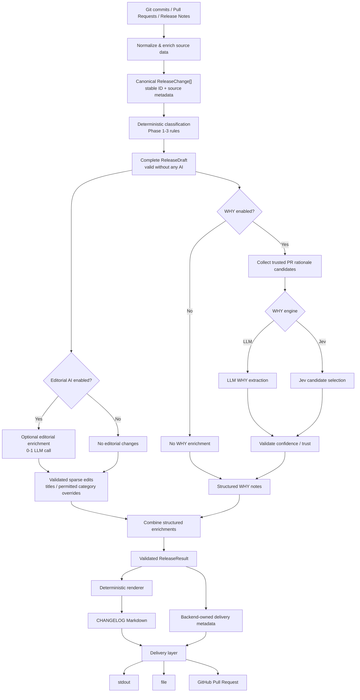
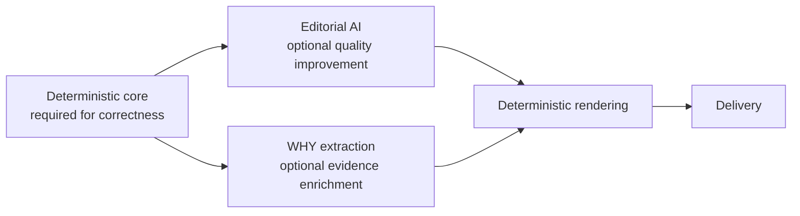

# v1 Changelog Content Pipeline

## Status

Phases 1-3 are implemented. They establish canonical `ReleaseChange`
identities, ID-based reconciliation, and deterministic classification
precedence. Phases 4-7 are planned implementation work for v1.

Each numbered phase should remain a separately reviewable change and preserve
existing output unless its acceptance criteria explicitly change behavior.

## Background

The original pipeline identified changes by their display titles, asked
providers to return category-to-title maps, and let provider output include
Markdown and delivery metadata. This makes duplicate titles ambiguous, allows
omitted classifier entries to disappear, and spreads classification rules
across provider, heuristic, tuning, and rendering paths.

The v1 pipeline is deterministic-first: the backend must always be able to
produce a complete, valid changelog without an LLM. AI is an optional
enrichment layer, not a prerequisite for correctness. The work already
completed in Phases 1-3 provides the foundation for that boundary.

## Target architecture

The target pipeline is:

```text
source changes
→ normalize / enrich
→ canonical ReleaseChange[]
→ deterministic classification
→ complete ReleaseDraft
→ optional editorial enrichment
→ optional WHY enrichment
→ validated ReleaseResult
→ deterministic renderer
→ delivery
```

The critical invariant is that a complete, valid `ReleaseDraft` exists before
either optional AI stage runs. If editorial AI or WHY enrichment is disabled,
unavailable, or fails, the deterministic draft remains a usable result with
diagnostics describing the degraded enrichment.





## Design principles

- Deterministic generation is the correctness baseline; AI is optional
  enrichment.
- Never lose a source change silently. Every source change retains a stable
  identity through normalization, classification, enrichment, and validation.
- Use stable IDs for reconciliation; titles are content, not identity.
- Deterministic classification and hard precedence rules remain authoritative.
  In particular, breaking-change signals and conventional commit rules cannot
  be overridden by an editorial suggestion.
- Provider responses may modify only explicitly permitted editorial fields.
- Structural Markdown has one backend-owned deterministic renderer.
- WHY is structured enrichment before rendering, never Markdown
  post-processing.
- Delivery metadata is separate from generated release content and is never
  provider-controlled.
- Optional enrichment failures preserve typed diagnostics but do not invalidate
  the deterministic result.
- Keep each migration phase behavior-compatible where practical.

## Editorial AI model

The main provider does not author changelog Markdown. After deterministic
classification produces a valid `ReleaseDraft`, a single optional editorial
pass may return sparse, ID-keyed edits. Its schema is intentionally not fixed
by this design, but conceptually it can resemble:

```json
{
  "changes": {
    "pr:123": {
      "title": "Add deterministic changelog rendering"
    },
    "pr:456": {
      "category": "Changed"
    }
  }
}
```

The editorial boundary is:

- Missing IDs mean no editorial change; the source title and deterministic
  classification remain in effect.
- Unknown IDs are rejected.
- Source titles remain the fallback when no title edit is returned.
- Structural Markdown is never provider-authored.
- Deterministic classification remains authoritative. A permitted category
  suggestion is applied only after deterministic precedence validation, and
  cannot override hard signals such as breaking changes or conventional commit
  rules.
- Custom instructions and language settings may influence editorial wording
  and permitted grouping or classification decisions, but never Markdown
  structure.
- The normal Phase 4 path makes at most one main editorial LLM call, rather
  than separate classification and generation calls.

Phase 4 does not introduce classification-confidence heuristics or selectively
skip editorial calls. Those are possible future optimizations, not required for
the v1 architectural boundary.

## WHY enrichment

WHY extraction is an independent optional enrichment stage. It must not be
combined with the general editorial response because it has different evidence
and trust requirements. It may use either the configured LLM provider or the
experimental Jev WHY engine.

```text
ReleaseDraft / ReleaseChange[]
→ determine eligible WHY targets
→ collect trusted PR rationale candidates
→ LLM or Jev WHY extraction
→ trust / confidence validation
→ attach structured WHY notes to release data
→ renderer
```

Phase 4 replaces the current model of discovering WHY targets by parsing
generated Markdown and inserting WHY text by mutating completed Markdown.
The renderer is the only component that formats final WHY Markdown. WHY
failure or absence never prevents generation of the valid deterministic
changelog.

## Renderer and delivery boundary

`src/utils/release-section.ts#buildSectionFromRelease` represents the
direction for the single shared renderer. All generation paths must converge on
structured release data and that renderer:

- normal AI-enabled generation;
- release-note input;
- fallback and no-AI generation; and
- WHY-enriched output.

The renderer exclusively owns structural Markdown, including headings,
category ordering, bullets, PR links, anchors, compare links, and WHY note
formatting. For example:

```md
## [vX.Y.Z] - YYYY-MM-DD

### Added

- <title> by @<author> in [#<pr>](<url>)
  - Why: <reason>

**Full Changelog**: <url>
```

Compatibility means structural Markdown remains byte-for-byte compatible for
equivalent structured and editorial inputs unless an acceptance criterion
explicitly changes the output. It does not promise byte-for-byte identity for
nondeterministic model-authored prose.

The backend constructs delivery metadata separately from release content.
Providers cannot control version headings, category headings, bullet
formatting, anchors, compare links, `Full Changelog` formatting, PR title, PR
body, labels, branch name, or destination information.

## Implementation phases

### 1. Introduce the canonical release-change identity (implemented)

Add a `ReleaseChange` domain type with a stable `id` and a discriminated
`origin` (`pull-request`, `commit`, or `release-note`). Convert parsed release
items and commit/PR-derived items into this type before classification.

Acceptance criteria:

- Pull requests use `pr:<number>` IDs.
- Unmapped commits use `commit:<sha>` IDs.
- Release-note-only items use deterministic `release-note:<index>` IDs.
- Duplicate display titles with different origins retain distinct IDs.
- Repeated references to the same explicit PR become one canonical change.
- Changes resolving to the same PR during enrichment are deduplicated before
  classification.
- Generated Markdown remains unchanged.

### 2. Classify by ID and reconcile provider output (implemented)

Replace category-to-title responses with assignments keyed by release-change
ID. Validate category names and reconcile the response against the input set.

Acceptance criteria:

- Every input ID appears exactly once after reconciliation.
- Unknown IDs and unknown categories are rejected.
- Missing IDs fall back to deterministic classification and produce a
  diagnostic.
- Duplicate titles do not affect classification or rendering.

### 3. Consolidate deterministic classification (implemented)

Replace the separate fallback, score, and post-classification precedence rules
with one canonical classifier. Provider classifications may be corrected by
explicit source signals.

Precedence:

1. Conventional breaking marker or explicit breaking metadata.
2. Conventional commit type.
3. Strong semantic signals.
4. Weak semantic signals.
5. `Chore` fallback.

Acceptance criteria:

- Scoped and unscoped `feat!:` / `fix!:` changes are `Breaking Changes`.
- AI and no-AI paths apply the same hard rules.
- Existing scoring fixtures continue to pass unless they contradict the
  precedence above.

### 4. Build a deterministic release result and render it structurally

Produce canonical release data and deterministic classification before optional
AI. Build a complete `ReleaseDraft` that is valid with zero provider calls,
then apply optional sparse editorial and WHY enrichments to structured data.
Validate the final `ReleaseResult`, render it with the shared backend renderer,
and construct delivery metadata separately.

The Phase 4 flow is:

```text
ReleaseChange[]
→ deterministic classification
→ complete ReleaseDraft
→ optional sparse editorial enrichment
→ validation / deterministic precedence
→ deterministic renderer
```

Phase 4 work:

1. Produce canonical release data and deterministic classification before
   optional AI.
2. Build a complete release draft that is valid without a provider call.
3. Replace provider-authored Markdown with sparse editorial enrichment over
   stable IDs.
4. Move WHY insertion to structured enrichment before rendering.
5. Render all structural Markdown through one backend renderer.
6. Separate release content from PR and delivery metadata.
7. Preserve current output formatting where practical.

Acceptance criteria:

- A complete changelog can be produced with zero LLM calls.
- Provider failure leaves the deterministic draft usable.
- Provider responses cannot author structural Markdown.
- Sparse editorial edits reconcile by stable ID.
- Unknown editorial IDs are rejected.
- Missing editorial IDs leave source data unchanged.
- Deterministic classification precedence remains authoritative.
- Full-generation, release-note, no-AI, and WHY-enriched paths share the same
  renderer.
- WHY notes are attached to structured release data before rendering.
- No post-render Markdown mutation is required for WHY.
- Delivery fields are not provider-controlled.
- Equivalent structured inputs produce deterministic structural Markdown.

### 5. Enforce completeness and empty-release behavior

Validate the final structured `ReleaseResult` before rendering, rather than
trying to infer completeness from generated Markdown. Replace the fabricated
`Summary of changes` fallback with an explicit typed no-change policy.

Acceptance criteria:

- No source change disappears without a recorded exclusion reason.
- Duplicate IDs fail validation.
- An empty release returns a typed no-change result rather than invented text.
- No `Summary of changes` is fabricated.
- CLI behavior for no-change results is documented and tested.

### 6. Preserve enrichment diagnostics and bound concurrency

Treat GitHub metadata lookup, editorial AI, and WHY enrichment as optional,
degradable enrichment stages. Preserve typed diagnostics and fetch independent
PR metadata with a small concurrency limit.

Acceptance criteria:

- Not found, unauthenticated, rate-limited, invalid-response, and network-error
  outcomes are distinguishable.
- Optional enrichment failures do not remove release changes or invalidate the
  deterministic release result.
- Dry-run diagnostics summarize degraded metadata and enrichment.
- Concurrency is bounded and covered by tests.

### 7. Separate output destinations

Model generation independently from delivery so the same validated
`ReleaseResult` and rendered content can be printed, written to a file, or
submitted as a pull request. The delivery layer consumes generated content plus
backend-owned delivery metadata.

Acceptance criteria:

- Generation has no filesystem or GitHub write side effects.
- `stdout`, `file`, and `pull-request` delivery paths consume the same result.
- Delivery metadata is constructed by the backend, not a provider.
- The public CLI choice and compatibility behavior are documented before this
  phase is implemented.

## Product decision: changelog audience

Before changing default category visibility, decide whether the primary output
is a complete maintainer log or user-facing release notes. A later design may
introduce an audience policy such as `user`, `maintainer`, or `all`; this is not
part of the mechanical pipeline migration above.

## Explicit non-goals

This design update establishes the architectural boundary:

```text
deterministic core → optional structured enrichment → deterministic rendering → delivery
```

It does not require Phase 4 to:

- implement confidence scoring for normal changelog classification;
- dynamically decide whether an editorial LLM call is worthwhile;
- merge editorial generation and WHY extraction into one request;
- redesign Jev;
- change category visibility or audience policy;
- implement all Phase 5-7 behavior immediately; or
- introduce unrelated provider abstractions, including a shared provider base
  class or additional orchestration-module splitting solely by file size.
